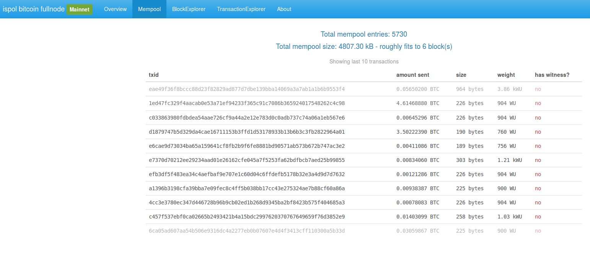
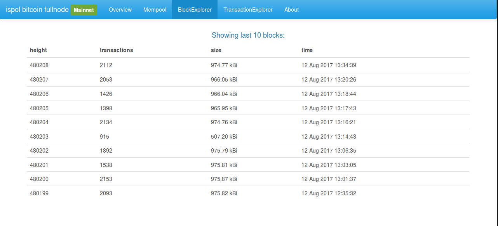
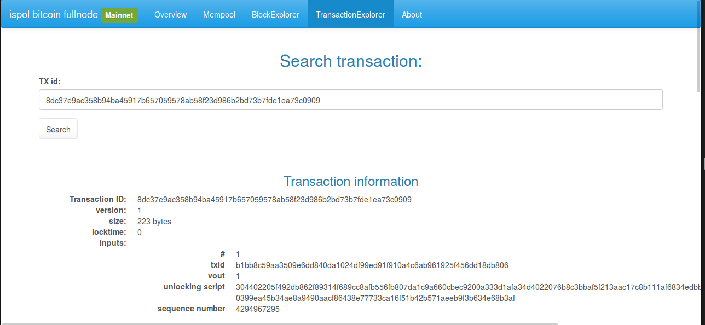

# 01C Node

This is a webfrontend for a full bitcoin node. Bitcoin-core is running as the backend and this little app allows you to see the status of the node through an easy graphical web frontend. 

# demo page
demo page can be found at http://node.ispol.sk

# Implemented pages:
- overview - shows basic info about the node like processor count, available memorry, active interfaces, connected peers, client version, number of blocks, synced state, etc.

- mempool - page shows total mempool entries, size of the mempool, to how many blocks would the transactions roughly fit, transaction size, weight and if the transaction has a witness (is segwit). Shows the last 10 txes in realtime that the bitcoind client sent us through zeromq. 

- block explorer - the 10 latest blocks are shown, their size, weight, timestamp 

- transaction explorer - details about a TX are shown once the hash is included in the search bar


# how to setup:
- download bitcoin-core

- build it with zeromq support (zeromq is needed for the mempool page to work, in case you do not want to see realtime tranasctions this step can be ommited)

- make some extra bitcoin configuration to make the frontend work (note: turning on txindex will require to reindex the whole blockchain which takes a lot of time, you were warned :). You can ignore that setting, the TransactionExplorer page will only show your transactions in that case. ). I recommend running this frontend with bitcoin-core launched with -disablewallet (or add disablewallet=1 to bitcoin.conf) in case you did not read the source code of this tool fully - you should never trust anyone
```
daemon=1
rpcuser=<some user>
rpcpassword=<a very secret password>
server=1
rest=1
zmqpubhashtx=tcp://127.0.0.1:28332
zmqpubhashblock=tcp://127.0.0.1:28332
zmqpubrawblock=tcp://127.0.0.1:28332
zmqpubrawtx=tcp://127.0.0.1:28332
txindex=1
disablewallet=1
```
- get this repo via git and edit the file config/default.yaml - the credentials should be the same as in your bitcoin.conf. Also adjust the host and port accordingly. Make sure you set your home dir if not the default in the config file.
```
RPC:
  host: localhost
  port: 8332
  rpc_username: <some username>
  rpc_password: <a very secret password>
```
- then install the dependencies:
```
npm install
```
- build the javascript bundle file
```
npm run build
```
- and start the web frontend (please note it will run in a console, do not close it or your webserver will quit, still in developement, will be fixed later to deamonize)
```
node server.js
```
- browse to http://localhost:5000 to view the page (assuming bitcoin-core and the web frontend are on the same node)

# todos:
- see issues page

# donations:
please consider donating bitcoins if you like the project:


**bitcoin 3Fomcsyhc2gb5vyJLitJC8FXovBAnfWuAK**

# author
Tomas Kanocz
